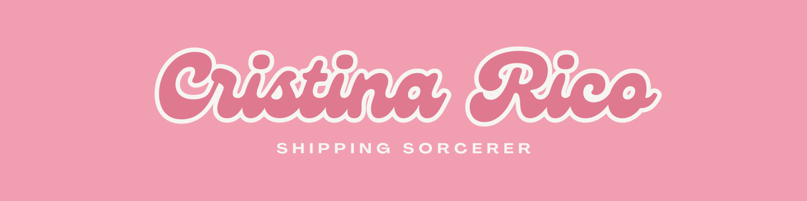

### Hi there 👋

I'm currently working on:

- Building my first web page using HTML!

I’m currently learning:

- The basics of HTML structure and tags.
- How to create well-organized and visually appealing web pages.

Ask me about:

- The logistics industry and its challenges.
- How I see what I'm learning potentially being used in my logistics operations.

How to reach me:

- cristina.rico.rios@gmail.com

Pronouns:

- She/her

⚡ Fun fact:

- Did you know the first website ever created went live in 1991? It was a simple informational page about the World Wide Web project itself!

